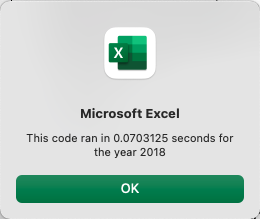

# Analysis of Stock Performance Using VBA

## Overview of Project

### Purpose
The purpose of this project is to create VBA code to automate the analysis of stock data so it can be performed easily and quickly. The project began with the need to analyze two years of data for a small set of green energy stocks in order to advise a pair of investors who are passionate about green energy. The next step in the analysis will include data from the entire stock market over several years. The expanded scope of the analysis requires code that can analyze a much larger dataset and still do so efficiently, which will be accomplished by refactoring the original VBA code. 

Below, I will discuss the results of the initial analysis of green energy stock data, comparing stock performance between 2017 and 2018. I will also discuss the design and performance of the original and refactored VBA code. I will conclude with a discussion of the advantages and disadvantages of refactoring code in general and specifically for this project. 

## Results

All analysis for this project was performed using a [dataset of 2017 and 2018 green stock daily performance](VBA_Challenge.xlsm).

### Stock Performance
Overall, performance of the 12 green energy stocks included in the initial analysis was much better for 2017 than for 2018.  For 2017, all but one stock had a positive rate of return, with four stocks having greater than 100% return. A stock of particular interest to our investors, Daqo New Energy (ticker: DQ), had the highest 2017 rate of return among the green energy stocks analyzed, at nearly 200%. Total daily volumes and returns for green energy stocks for 2017 are shown in the table below.

For 2018, the majority of green energy stocks analyzed had a negative rate of return, meaning they lost value. Only two stocks, Enphase Energy (ticker: ENPH) and Sunrun (ticker: RUN), had a positive rate of return for 2018. Daqo New Energy stock had a significant reversal in performance between 2017 and 2018, with -62.6% return for 2018. Total daily volumes and returns for green energy stocks for 2018 are shown in the table below.

### Code Performance
The initial analysis of green stock data was automated with VBA code, which can be found [here](Resources/VBA_Before_Refactoring.vbs). Since future analysis will include several years of data from the entire stock market, the original VBA code linked above was refactored to perform the analysis more efficiently so it can handle a much larger dataset. The refactored VBA code can be found [here](Resources/VBA_Challenge.vbs). The main portion of the code that was edited is shown below in its original and refactored versions. In the refactored code, a tickerIndex variable and tickerVolumes, tickerStartingPrices, and tickerEndingPrices output arrays were created to replace the need for the nested for loop used in the original code. The tickerIndex variable is used to access the stock ticker index for the output arrays as well as a tickers array so that the script can read and store values for tickers, volumes, and starting and ending prices (needed to calculate return) when looping through all rows of stock data just one time.

**Original VBA code:**

**Refactored VBA code:**

As expected, refactoring the code reduced the execution time, as shown in the screenshots below.

**Execution time for original VBA code for 2017 stock data:**

**Execution time for refactored VBA code for 2017 stock data:**

**Execution time for original VBA code for 2018 stock data:**

**Execution time for refactored VBA code for 2018 stock data:**

## Summary

### Advantages and Disadvantages of Refactoring VBA Code
A main advantage of refactoring VBA code is that refactored code can be more efficient, requiring fewer steps to accomplish the same task. Refactored code can run more quickly, increasing its usability for larger datasets. Refactored code can also be cleaner, more organized, and easier for others to understand and update.

A major disadvantage of refactoring VBA code is that it can be time consuming to do. Especially for new VBA coders, figuring out the logic to refactor code successfully can be a challenge. Additionally, in the course of refactoring code, functionality that worked in the original code may break, requiring additional problem solving and testing to get the code working again. 

### Advantages and Disadvantages of Original and Refactored VBA Code for Analyzing Stock Performance
With respect to the VBA code for this project, the refactored code has a clear advantage over the original code in terms of efficiency, as the execution times for the refactored code were shorter than for the original code, as shown in the screenshots above. The increased efficiency of the refactored code should translate to better usability for a larger dataset of all stocks.

Refactoring the code did prove time consuming for me. It required a substantial amount of trial and error and debugging to get the refactored code working correctly. In comparing the original code with the refactored code, the original code seems less complex and easier to understand than the refactored code, but my perspective as a new VBA coder is likely a factor in this assessment.
